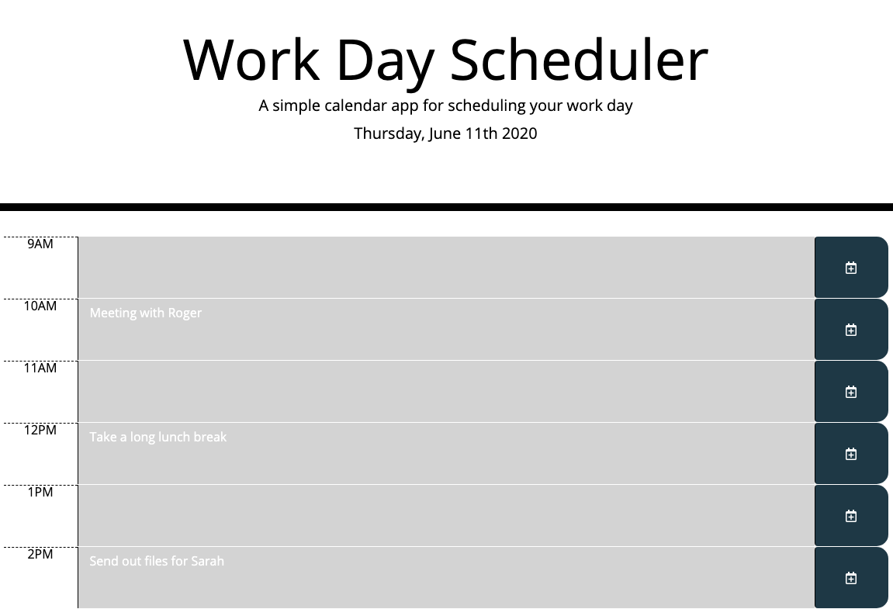
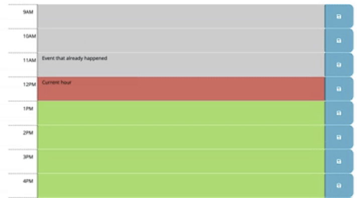

# Work-Day-Scheduler

I created this Ultimate Coding Quiz during my time at Northwestern Full Stack Coding Bootcamp. The assignment was as follows:

Create a simple calendar application that allows the user to save events for each hour of the day. This app will run in the browser and feature dynamically updated HTML and CSS powered by jQuery.

There was specific criteria that we had to meet, which is listed below:

GIVEN I am using a daily planner to create a schedule:
WHEN I open the planner,
THEN the current day is displayed at the top of the calendar.
WHEN I scroll down,
THEN I am presented with timeblocks for standard business hours.
WHEN I view the timeblocks for that day,
THEN each timeblock is color coded to indicate whether it is in the past, present, or future.
WHEN I click into a timeblock,
THEN I can enter an event.
WHEN I click the save button for that timeblock,
THEN the text for that event is saved in local storage.
WHEN I refresh the page,
THEN the saved events persist.

Below are some screenshots of the working application:

Initial page when booting up the application:

Color coding time slots to show what the current our is, what is in the past and future:

